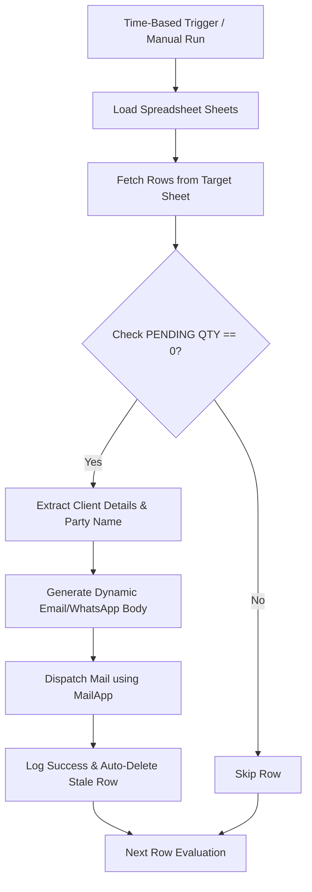

## 🌟 1. The Core Philosophy: Bulk Notification Engine
The **Bulk Email & WhatsApp Automation Tool** is a high-performance backend utility custom-engineered during my tenure at **CMCTextile**. The main goal of this system is to bridge order tracking sheet metrics with automated instant dispatch networks to completely eliminate human administrative lag.

*   **Zero-Dependency Integration:** Operates natively inside the Google Workspace ecosystem using Apps Script engine, completely avoiding the initial friction and subscription overhead of third-party mailing endpoints.
*   **Conditional Triggering:** Monitors the central order sheet dynamically, checking metrics like `PENDING QTY`. The second a critical threshold or zero quantity is reached, the automated pipeline kicks in immediately.
*   **Safety Limits & Efficiency:** Implements structured daily quotas (e.g., capping native MailApp dispatches at 50/day) to prevent execution limit issues and domain spam filtering, ensuring high deliverability.

---

## 🛠 2. Technical Architecture & Tech Stack

| Component | Technology | Role & Rationale |
| :--- | :--- | :--- |
| **Automation Engine** | **Google Apps Script** | Serves as the core logic handler. Integrates natively with active spreadsheet triggers, requiring zero standalone server hosting. ⚡ |
| **Data Repository** | **Google Sheets API** | Acts as the central order tracking hub, tracking design codes, purchase orders, and recipient metrics. 📊 |
| **Mail Dispatcher** | **MailApp Service** | Leverages built-in Google network capabilities to process SMTP envelopes directly from Authorized accounts. 📨 |
| **Scheduling Engine** | **Time-Based Triggers** | Polls active cells on configurable increments (e.g., every 30 minutes) to automate status checks even when the sheet is closed. ⏳ |
| **Extensibility APIs** | **REST Fetch Suite** | Prepared network handlers designed to consume Twilio / Chat API REST Endpoints to integrate WhatsApp notifications. 📱 |

---

## ⚙️ 3. Execution Pipeline & Row Management

### Key Workflow Features:
1.  **Row Management & Duplicate Blockers:** The script reads raw records, checks the status, sends notifications, and then **auto-deletes the row or flags it** to completely prevent duplicate emails.
2.  **Customizable Layout Templating:** Injects design details (`FG Code`, `Design No`, `Party Name`) dynamically into predefined HTML layouts to match CMCTextile's corporate branding.
3.  **Scheduled Polling:** A native clock trigger executes the sheet scanner in the background periodically, letting administrators close their browser tabs without stopping the automated checks.

---

## 📋 4. Direct Setup & Adaptation Guide

### Prerequisites
*   A Google Sheet containing tracking columns: `PENDING QTY`, `Email Recipient`, `Design No`, etc.
*   Google Workspace Account with standard MailApp access.

### Quick Setup Steps
1.  Open your Google Sheet, select **Extensions** -> **Apps Script**.
2.  Delete any default content and paste the core Apps Script file `Bulk_Email_Notification_Sender.gs`.
3.  Modify the global `senderEmail` variable to point to your targeted notifications inbox.
4.  Save, authorize permissions, and run `sendBulkEmails()` to check initial delivery!

---

## 🤝 5. Collaboration & Future Roadmap
The codebase is structured modularly to allow other developers or contributors to implement further enhancements:
*   **Twilio WhatsApp APIs:** Integrating Twilio SDK endpoints to add SMS/WhatsApp backup capabilities.
*   **Zoho & Outlook Integrations:** Support for multi-SMTP services.
*   **HTML Dashboard:** Creating a custom HTML sidebar inside Google Sheets for a user-friendly setup control panel.
