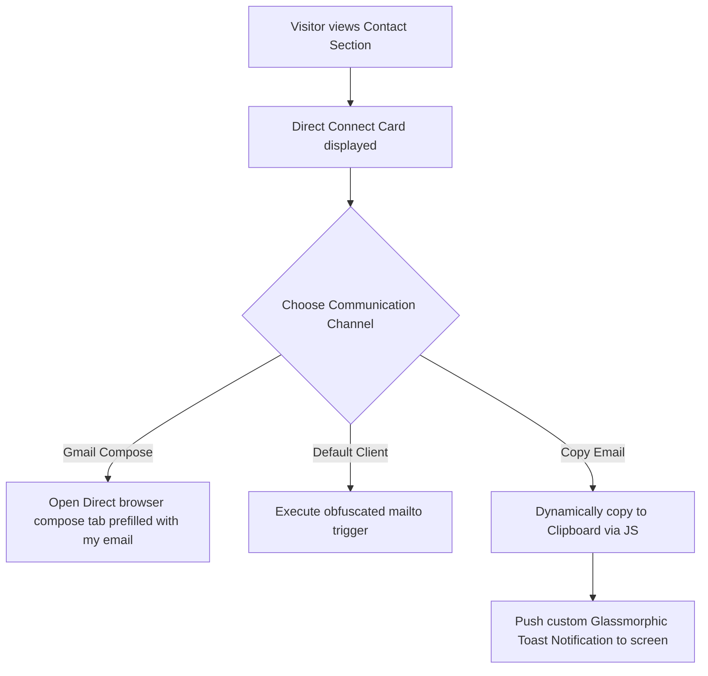

## 🌟 1. Design Philosophy: Visual Sanctuary & Glassmorphism
The **Interactive Developer Portfolio** is designed as a custom digital playground showcasing raw engineering capabilities alongside sophisticated UI/UX aesthetics. Rather than utilizing bulky front-end CSS frameworks (like Tailwind or Bootstrap) that lead to cookie-cutter layouts, this project is built entirely on vanilla foundations to ensure absolute control over every pixel, micro-interaction, and performance budget.

*   **Premium Dark UI:** Styled around deep carbon palettes (`#121212`, `#1E1E1E`) paired with vibrant teal accent glows (`#1ABC9C`) to offer maximum legibility, reduced eye strain, and high-end visual elegance.
*   **Frosted Glassmorphism:** Implements subtle CSS translucent layers (`rgba(30, 30, 30, 0.65)`) with native backdrops (`backdrop-filter: blur(12px)`) and soft white inner borders (`rgba(255, 255, 255, 0.05)`) to give a modern floating aesthetic.
*   **Sleek Micro-Animations:** Uses hardware-accelerated CSS transitions for hover actions, timeline animations, and active state transformations, creating an interface that feels responsive and alive.

---

## 🛠 2. Core Architectural Tech Stack

| Component | Technology | Role & Key Features |
| :--- | :--- | :--- |
| **Markup Foundation** | **Semantic HTML5** | Ensures perfect accessibility, clean SEO hierarchy, descriptive landmarks, and fast parsing. 🧱 |
| **Styling Framework** | **Custom Vanilla CSS3** | Employs custom CSS variables (`--accent-color`, `--card-bg`), flexible flexbox/grid containers, and custom media queries for fluid responsive shifts. 🎨 |
| **Application Logic** | **Modern JS (ES6+)** | Drives the interactive experience, handling active scroll animations, DOM updates, and custom notifications. ⚡ |
| **Direct Contact Suite** | **Gmail Web API Direct Link** | Bypasses slow backend mail servers, triggering instant, pre-filled, browser-based Gmail compose windows directly. 📨 |
| **Toast System** | **Glassmorphism Toast API** | A completely custom-built JavaScript notification system presenting beautiful floating alerts upon copy actions. 🔔 |

---

## 🔒 3. Secure direct contact & Client-Side Copy
To resolve the high latency, preflight CORS errors, and server dependencies of classic contact forms, the portfolio utilizes a dual client-side notification suite:

### Key Security Implementations:
1.  **Email Scraping Obfuscation:** The raw email address (`adarshkumar9172641@gmail.com`) is never written as raw HTML strings inside elements, protecting the inbox from basic crawler scrapers. Instead, the final email is constructed dynamically inside closures on the click event listener.
2.  **Zero-server dependency:** Bypassing FormSubmit endpoints ensures that visitors can send messages securely and instantly from their own personal Gmail accounts with zero risk of service outage or delivery drops.

---

## 📱 4. Responsive Grid & Fluid Typographies
The entire portfolio utilizes a custom-engineered responsive structure designed to adjust gracefully across all form factors:
*   **Fluid Timeline:** The experience chronologies slide dynamically on larger screens, adjusting into compact vertical layouts on tablet and mobile viewports.
*   **Grid Scaling:** Project cards use custom autofit grids (`grid-template-columns: repeat(auto-fit, minmax(300px, 1fr))`) to seamlessly scale columns without clipping or manual resizing.
*   **Typography Hierarchy:** Font settings use scalable units (`rem`, `em`, `vh`) ensuring text remains readable and sharp on any resolution, from tiny mobile screens to large desktop monitors.

---

## 👨‍💻 5. About the Developer: Adarsh Kumar
Behind this portfolio is **Adarsh Kumar**, a dedicated Android and Full-Stack Software Engineer with a deep passion for creating visual sanctuaries, low-latency architectures, and robust automation pipelines.

*   **Focus & Expertise:** Specialized in high-performance Android development (Kotlin, Jetpack Compose, Room DB) and responsive, glassmorphism-based web frontends (HTML5, Vanilla CSS3, ES6+ JS).
*   **Engineering Philosophy:** Strongly believes in zero-dependency, zero-overhead, and high-performance solutions. Whether building secure direct email copy suites or background spreadsheet polling scripts, my goal is to deliver clean, maintainable, and robust codebases.
*   **Future Vision:** Constantly pushing boundaries to integrate advanced REST APIs, smooth micro-interactions, and professional UI layouts, turning creative ideas into scalable production products.
